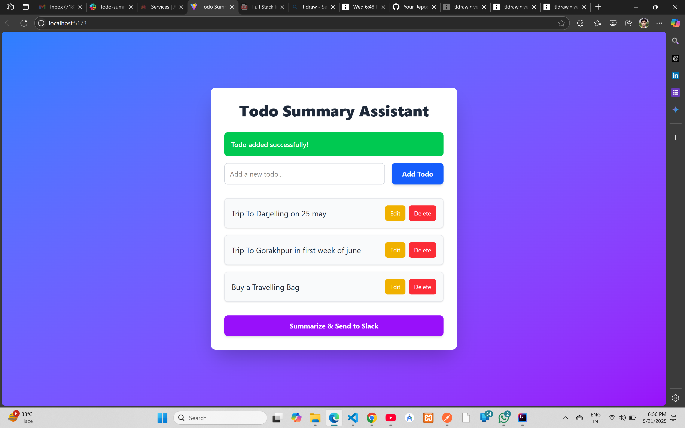
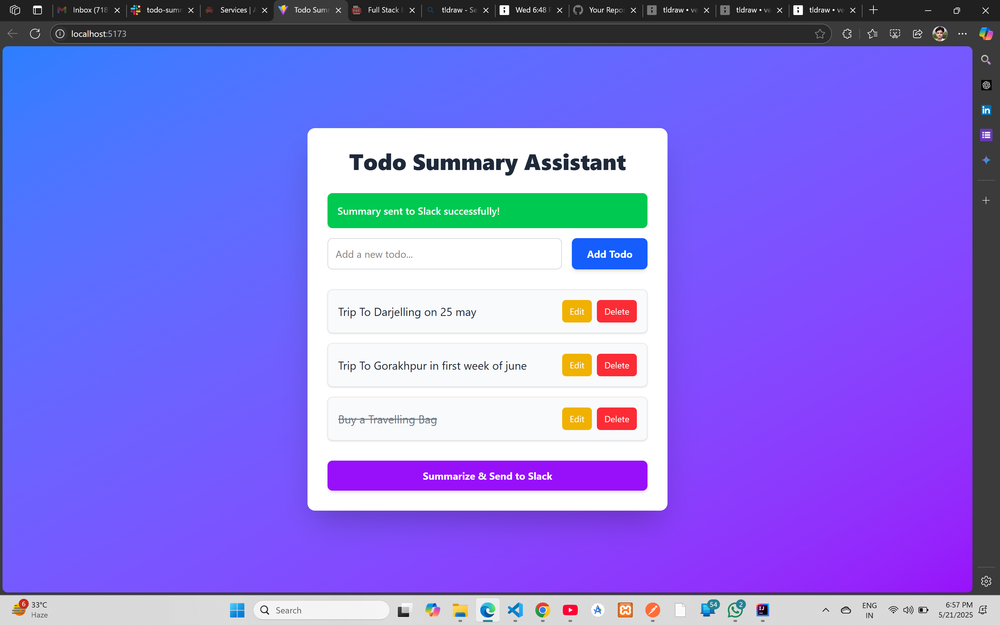
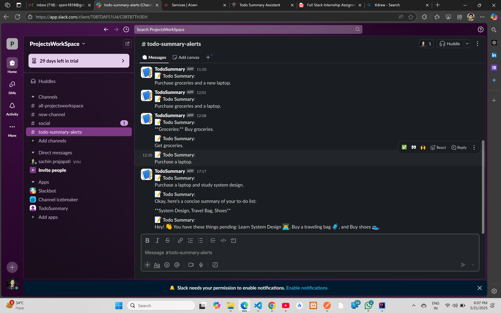
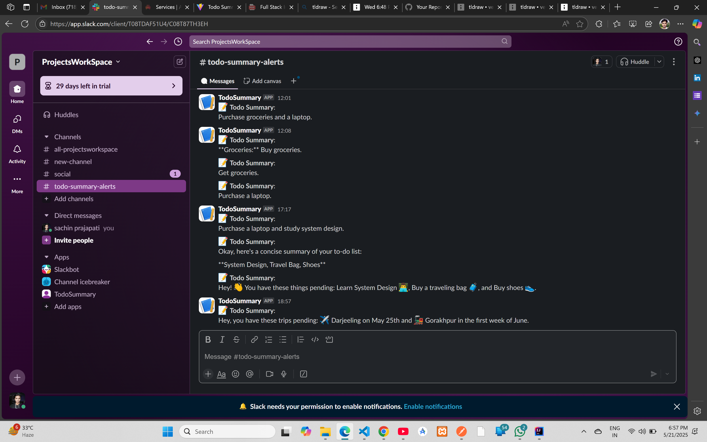
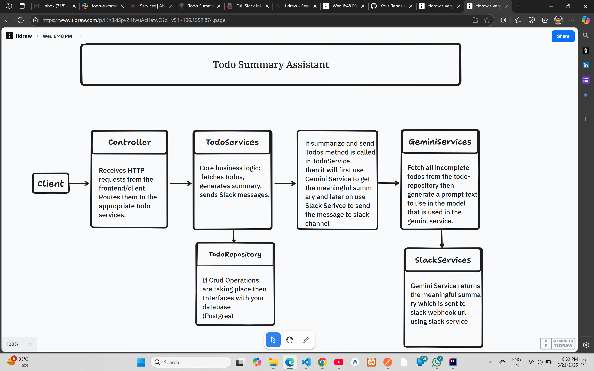

# 📋 Todo Summary Assistant

Welcome to the **Todo Summary Assistant**, a full-stack application that lets you manage your to-do list, generate summaries of pending tasks using **Gemini AI** 🤖, and share them directly to a **Slack** channel 📢. This guide is designed to be clear, structured, and engaging, with all the details you need to understand and set up the project! 🚀

---

## 📸 Screenshots

### Frontend (React) 🎨
- 🖼️ **Todo List View**: See all your tasks in a clean, user-friendly interface.  

  
- 🖼️ **Add/Edit Tasks**: Easily add, update, mark tasks as complete with a sleek form.  

  
- 🖼️ **Todo Summarize Actions**: Summarize todo and send it to a slack channel.  

  

### Slack Integration 💬
- 📩 **Task Summary in Slack**: Receive beautifully formatted task summaries in your Slack channel.  

  
- 📩 **Confirmation**: Get notified when summaries are successfully sent.  

  

### Backend Project Flow 🛠️
- 🗺️ **Workflow Diagram**: A visual guide to how the backend processes tasks.  
    

  🔗 [Link to Backend Project Flow](https://www.tldraw.com/p/iKnBkiSpv2IHwuAcHafwO?d=v51.-106.1552.874.page)

---

## 🗂️ Project Structure

- 📁 **`/backend`**: Java Spring Boot backend for handling API requests and integrations.
- 📁 **`/frontend`**: React frontend for a smooth and interactive user experience.

---

## ✨ Core Functionality

### Frontend (React) ⚛️
- ➕ **Add Tasks**: Create new to-do items effortlessly.
- 👀 **View Tasks**: Display all tasks with their status (complete/incomplete).
- ✅ **Complete Tasks**: Complete with a single click.
- ✏️ **Edit Tasks**: Modify existing tasks easily with edit button.
- 🗑️ **Delete Tasks**: Remove tasks you no longer need.
- 📤 **Generate & Share Summary**: Trigger a summary of pending tasks and send it to Slack.
- 🔔 **Feedback**: See success or error messages for Slack operations.

### Backend (Spring Boot) ⚙️
- 🌐 **API Endpoints**:
  - `GET /api/todos`: Retrieve all to-do items.
  - `POST /api/todos`: Add a new to-do.
  - `PUT /api/todos/{id}`: Update a task (e.g., mark as complete).
  - `DELETE /api/todos/{id}`: Delete a task.
  - `POST /api/todos/summarize`: Generate a summary of pending tasks using Gemini AI and send it to Slack.
- 🗄️ **Database**: Integrates with **PostgreSQL** to store to-do items.
- 🤖 **Gemini AI**: Summarizes tasks using the Gemini API.
- 📢 **Slack**: Sends summaries to a Slack channel via Incoming Webhooks.

---

## 🛠️ Setup Instructions

### Prerequisites 📋
- ☕ **Java 17** or later
- 🛠️ **Maven 3.6** or later
- 🌐 **Node.js** and **npm** (for React frontend)
- 🗄️ **PostgreSQL Server**

### 1. Database Setup (PostgreSQL) 🗄️
1. Use **Aiven PostgreSQL** or any other PostgreSQL server of your choice.
2. Ensure your database is running and accessible.

### 2. Backend Setup (Spring Boot) ⚙️
1. Navigate to the `/backend` directory:
   ```bash
   cd backend
   ```
2. Configure your **database connection**, **Gemini API key**, and **Slack Webhook URL** in `src/main/resources/application.properties`.  
   A real configuration is provided in `.env.sample`. Copy it to `application.properties` and update with your credentials:
   ```properties
   server.port=8080

   spring.datasource.url=jdbc:postgresql://<DB_HOST>:<DB_PORT>/<DB_NAME>?sslmode=require
   spring.datasource.password=<DB_PASSWORD>
   spring.datasource.username=<DB_USERNAME>
   spring.datasource.driver-class-name=org.postgresql.Driver
   spring.jpa.database-platform=org.hibernate.dialect.PostgreSQLDialect
   spring.jpa.hibernate.ddl-auto=update
   spring.datasource.hikari.connection-timeout=20000
   spring.datasource.hikari.maximum-pool-size=5

   # API Keys and URLs
   gemini.api.key=<YOUR_GEMINI_API_KEY>
   gemini.api.url=https://generativelanguage.googleapis.com/
   gemini.model.name=gemini-2.0-flash

   slack.webhook.url=<YOUR_SLACK_WEBHOOK_URL>

   cors.allowed.origins=http://localhost:5173
   ```
3. Build and run the backend:
   ```bash
   mvn spring-boot:run
   ```
   The backend will be live at `http://localhost:8080`. 🎉

### 3. Frontend Setup (React) ⚛️
1. Navigate to the `/frontend` directory:
   ```bash
   cd frontend
   ```
2. Install dependencies:
   ```bash
   npm install
   ```
3. Start the React development server:
   ```bash
   npm run dev
   ```
   The frontend will be available at `http://localhost:5173`. 🚀

### 4. Environment Variables 🌍
- A `.env.example` file is included in the root directory as a template with real credentials.
- For the backend, manage environment variables in `application.properties` or as system environment variables in a deployed environment.

---

## 🤝 Slack & LLM Integration Setup

### Slack Integration 📢
1. **Create a Slack Incoming Webhook**:
   - Visit [Slack API](https://api.slack.com/apps).
   - Click **Create New App** → **From scratch**.
   - Name your app and select your workspace.
   - Go to **Incoming Webhooks** and toggle it **On**.
   - Click **Add New Webhook to Workspace**, select a channel, and click **Allow**.
   - Copy the **Webhook URL** (keep it secure 🔒).
   - Add the URL to `slack.webhook.url` in `application.properties`.

### Gemini AI Integration 🤖
1. **Obtain a Gemini API Key**:
   - Go to [Google AI Studio](https://aistudio.google.com/).
   - Sign in with your Google account.
   - Click **Get API key** in the left menu.
   - Copy the generated key (keep it secure 🔒).
   - Add the key to `gemini.api.key` in `application.properties`.
2. The app uses the `gemini-pro` model via `https://generativelanguage.googleapis.com/v1beta/models/gemini-pro:generateContent`.

---

## 🏗️ Design & Architecture Decisions

### Tech Stack 🛠️
- **Frontend**: React + Tailwind CSS for a modern, responsive UI. 🎨
- **Backend**: Java Spring Boot for robust API handling. ⚙️
- **Database**: PostgreSQL for reliable data storage. 🗄️

### Backend Structure 📚
- **Controller**: Manages HTTP requests and responses.
- **Service**: Handles business logic, coordinating with repositories and external services (Gemini, Slack).
- **Repository**: Uses Spring Data JPA for database operations.
- **Model**: Defines the `Todo` entity for data structure.

### Key Features 🌟
- **RESTful APIs**: Clean endpoints for CRUD operations and summarization.
- **Gemini Integration**: The `GeminiService` sends tasks to the Gemini API with a custom prompt for summarization.
- **Slack Integration**: The `SlackService` posts summaries to Slack using Incoming Webhooks.
- **Error Handling**:
  - Frontend: Shows user-friendly success/error messages. ✅❌
  - Backend: Uses try-catch blocks and returns proper HTTP status codes.
- **CORS**: Configured to allow requests from the React frontend (`http://localhost:5173`).
- **Simplicity**: Focused on core functionality with clear integrations for ease of use.

---
